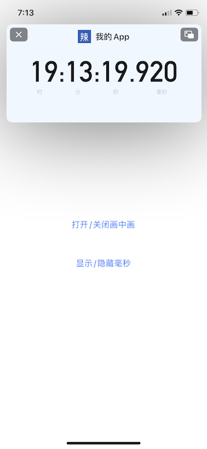

[中文文档](README_cn.md)

# Features:

1. You can add any custom view on the pip window;
2. You can hide speed button, backward button, play button and progress bar on the pip window;
3. You can modify the pip window’s shape dynamically with code;
4. You can rotate the pip window with code;
5. You can take photos and record a video while using pip;
6. The screen would not turn dark when you take photos or record videos;
7. Timer would never stop while taking photos or recording videos;
8. The timer's accuracy is millisecond;
9. The solution for your app rejected by Apple.

# Demos:

## 1. float_teleprompter

## 2. float_timer

# Contact:

For more technical exchange you can add my WeChat: *cq1351675135* or scan:

